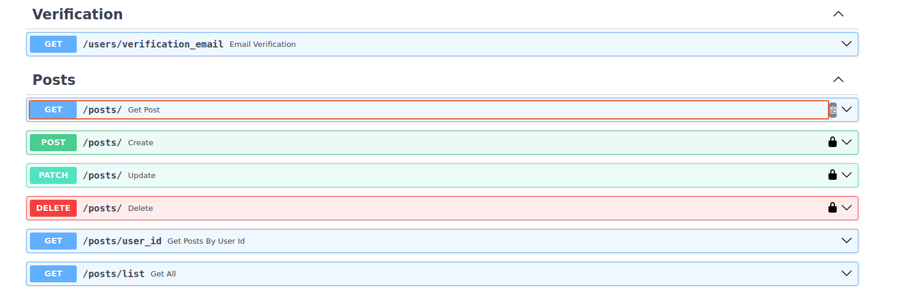

# Blog FastAPI

Это реализация серверной части для веб-блога на FastAPI.

## Реализованные функции:

   * JWT авторизация
   * CRUD пользователей
   * CRUD статей
   * Роли для пользователей и ограничения по ним
   * Возможность суперюзеру изменять роли пользователям
   * Отправка сообщения после регистрации на email для его подтверждения

## Для запуска приложения используйте docker-compose:
    
    
    1. docker compose build
    2. docker compose up

Переменные заданы в файле `.env.example`, 
если хотите, измените его.

Если вы не меняли `.env.example`, 
приложение запуститься на `http://localhost:8001/docs#/`

`flower` запуститься на `http://localhost:7777/`

Для того чтобы работала отправка сообщения на **email** пользователя
после его регистрации для подтверждения **email**,
измените в `.env.example` параметры SMTP на свои:
    
    SMTP_HOST=
    SMTP_PORT=
    SMTP_USER=
    SMTP_PASSWORD=

### Для запуска тестов: 
В локальном репозитории используйте команду:

    make run tests

Для прогона тестов будет запущен контейнер PostgreSQL на порту `5632`.

## Endpoints

* Users
    * `/users` - [GET, POST, PATCH, DELETE] - поиск, регистрация,
изменение и удаление пользователя.
    * `/users/list` - [GET] - список всех пользователей.
    * `/users/me/posts` - [GET] - список постов, аутентифицированного пользователя.
* Users login
    * `/users/token` - [POST] - получить токен авторизации.
* Users privileges
    * `/users/give_admin_privileges` - [PATCH] - выдача прав администратора суперюзером.
    * `/users/remove_admin_privileges` - [PATCH] - удаление прав администратора суперюзером.
* Users verification
    * `/users/verification_email` - [GET] - проверка email для его подтверждения.
* Posts
    * `/posts/` - [GET, POST, PATCH, DELETE] - поиск, создание,
изменение и удаление поcта.
    * `/posts/list` - [GET] - список всех постов.
    *  `/posts/user_id` - [GET] - список всех постов конкретного пользователя.